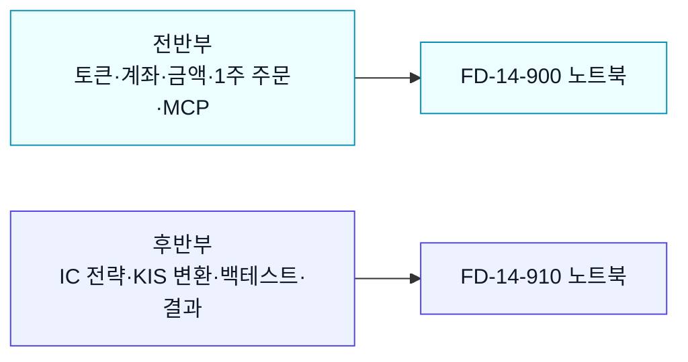
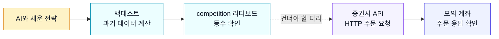

## 내가 세운 전략을, 진짜로 돌려본다

이번 주는 두 흐름으로 나뉜다. 전반부는 KIS 계좌를 직접 만져 보는 성공 경험이고, 후반부는 competition 전략을 KIS와 백테스트로 옮기는 경험이다.

> [!info] 학습 목표
>
> - competition에서 AI와 함께 세운 전략을 "진짜 증권사 서버"에서 돌려보는 것이 이번 주의 목표임을 안다
> - 증권사 API가 무엇이고, 사람이 HTS 화면을 클릭하는 일을 코드가 대신한다는 점을 설명할 수 있다
> - 왜 이 강의가 한국투자증권(KIS)을 골랐는지, 그 근거를 한 문장으로 말할 수 있다
> - mock(모의)과 live(실전)의 차이, 그리고 강의가 처음부터 끝까지 mock만 쓰는 이유를 설명할 수 있다

---

## 🏆 지금까지 한 일 — 그리고 빠진 한 조각

지난 몇 주 동안 한 일을 떠올려 본다. AI와 함께 전략을 설계했고, 과거 데이터로 백테스트를 돌려 "이 규칙이라면 수익이 났을 것이다"라는 숫자를 손에 쥐었다. competition 리더보드에 등수도 찍혔다.

그런데 한 가지가 빠졌다. ==그 전략을 실제로 돌려본 적은 한 번도 없다.==

- 백테스트는 과거 데이터 위에서 "샀다 팔았다면?"을 **계산**한 것이다
- 리더보드 등수는 그 계산 결과를 학생끼리 비교한 것이다
- 어느 단계에서도 진짜 증권사 서버에 "이 종목 사줘"라는 요청은 가지 않았다

비유하자면 요리 레시피를 완벽하게 적어두고 점수까지 받았는데, 아직 한 번도 불 앞에 서보지 않은 상태다. 이번 주에 그 불 앞에 선다. 내가 만든 전략을 진짜 증권사 시스템에 연결해 ==모의 계좌로 주문 요청을 보내고 응답을 확인하는 순간==을 본다.

---

#### 🌉 competition에서 실전으로 — 건너야 할 다리

competition과 실전 사이에는 건너야 할 다리가 하나 있다. 아래 그림이 그 다리다.

*왼쪽 세 칸은 지금까지 한 일이다 — 모두 "계산"의 세계에 머문다. 점선 다리를 건너야 비로소 증권사 서버에 닿아 계좌가 움직인다.*

*점선이 끊겨 보이는 것에 주목한다 — 백테스트가 좋은 숫자를 내도, 그것이 자동으로 주문으로 이어지지는 않는다. 이 다리를 코드로 직접 놓는 것이 이번 주다.*

이 다리의 정체는 무엇일까? 바로 **증권사 API**다.

---

#### 📞 증권사 API란 무엇인가

평소에 주식을 살 때를 떠올려 본다. HTS(홈 트레이딩 시스템)나 MTS(모바일 앱)를 켜고, 종목을 검색하고, 수량을 입력하고, 매수 버튼을 누른다. 이 ==사람의 클릭 동작을 코드가 대신하게 해주는 통로==가 증권사 API다.

- **API(Application Programming Interface)**: 프로그램끼리 정해진 약속으로 주고받는 창구다
- **증권사 API**: 내 코드가 증권사 서버에 "시세 알려줘", "이 종목 사줘" 같은 요청을 보내는 통로다
- 핵심: 사람이 화면을 클릭하던 일을 **코드가 HTTP 요청 한 줄**로 처리한다

| 사람이 직접 할 때 | 코드(API)가 대신할 때 |
|------------------|---------------------|
| HTS 화면에서 종목 검색 | `시세 조회` 요청 한 줄 |
| 마우스로 매수 버튼 클릭 | `주문` 요청 한 줄 |
| 사람이 깨어 있을 때만 가능 | 24시간 자동 실행 가능 |

competition에서 전략을 코드로 짰던 것처럼, 이제 ==주문까지 코드로== 처리한다. 그래야 내가 만든 전략이 사람 손을 거치지 않고 끝까지 자동으로 돌아간다.

---

#### 🏦 왜 한국투자증권(KIS)인가

증권사 API를 제공하는 회사는 한둘이 아니다. 그중 이 강의는 **한국투자증권(KIS)** 의 Open Trading API를 고른다. 이유는 초보자가 시작하기 좋은 조건이 모여 있기 때문이다.

- **모의투자 환경이 무료다** — 가짜 돈으로 실제와 똑같이 주문을 연습할 수 있다
- **공식 문서와 예제 코드가 GitHub에 공개돼 있다** — 막혔을 때 찾아볼 곳이 분명하다
- **국내 주식 중심이라 친숙하다** — 삼성전자·ETF 등 이름을 아는 종목으로 연습한다
- **REST API 방식이라 표준적이다** — 여기서 배운 "토큰 → 시세 → 주문" 흐름은 다른 증권사로도 그대로 이어진다

> [!info] 🌏 해외주식(미장)은?
> - KIS API는 국내 주식뿐 아니라 미국 주식(미장)도 지원한다
> - 다만 이번 주 **메인은 국내장**이다 — 종목이 친숙하고 흐름이 단순하기 때문이다
> - 미장(해외주식)을 코드로 다루는 상세 내용은 [[FD-14-800__appendix-other-brokers|§800 부록]]에서 따로 다룬다

---

#### 📂 KIS Developers — 모든 자료가 모여 있는 곳

한국투자증권은 개발자를 위한 공식 GitHub 저장소를 운영한다. 코드 예제, 인증 방법, 주문 방식이 전부 여기에 정리돼 있다. 막혔을 때 가장 먼저 찾아갈 곳이다.

[KIS open-trading-api 공식 저장소](https://github.com/koreainvestment/open-trading-api)

> [!tip]- KIS Open Trading API 이야기
> - 한국투자증권이 일반 개인 투자자도 코드로 자기 계좌를 다룰 수 있도록 공개한 공식 API다
> - 예전에는 증권사 자동매매가 기관·전문가의 영역이었지만, Open API 공개 이후 개인도 같은 방식으로 시스템을 만들 수 있게 됐다
> - GitHub에 예제를 공개한 덕분에, 우리는 "어떻게 요청을 보내야 하나?"를 처음부터 헤매지 않고 공식 예제를 출발점으로 삼는다

이 저장소가 있다는 사실만 기억하면 된다. 실제로 그 안의 어떤 코드를 어떻게 쓰는지는 다음 노트들에서 하나씩 풀어간다.

---

#### 🧪 연습장과 실거래 — mock과 live

여기서 가장 중요한 안전 개념을 짚는다. KIS API에는 두 가지 환경이 있다. ==이 둘을 헷갈리면 진짜 돈이 움직인다.==

| 구분 | mock (모의투자) | live (실전투자) |
|------|----------------|----------------|
| 돈 종류 | 가짜 돈 (연습용) | 진짜 돈 (실제 자금) |
| 잘못 주문하면 | 연습 계좌에서 가짜 돈 차감 | 실제 자금으로 매매 발생 |
| 키 | `KIS_MOCK_APP_KEY` 등 | `KIS_LIVE_APP_KEY` 등 |
| 이 강의에서 | ✅ 처음부터 끝까지 사용 | ❌ 절대 사용 안 함 |

이 강의는 ==처음부터 끝까지 mock만 사용한다==. competition 전략을 실제 시스템에서 돌려보는 경험이 목표이지, 진짜 돈을 거는 것이 목표가 아니기 때문이다. mock 환경은 진짜와 똑같은 주문 흐름을 가짜 돈으로 안전하게 연습하게 해준다.

> [!warning] ⚠️ mock과 live는 글자 하나 차이
> - 코드에서 mock과 live는 거의 같은 모양이다 — 바뀌는 건 키와 서버 주소뿐이다
> - 그래서 모드를 잘못 켜면 똑같은 코드가 진짜 돈을 움직일 수 있다
> - 이 강의의 모든 실습은 mock 기본값으로 안전하게 설계돼 있다 — 일부러 바꾸지 않는 한 진짜 돈은 절대 움직이지 않는다
> - mock에서 live로 "어떻게" 전환하는지, 그리고 그 위험을 막는 가드 장치는 [[FD-14-300__account-and-trading|§300 거래 실습]]에서 자세히 다룬다

---

## 🔖 핵심 요약

> [!summary] 🏆 이 노트를 마쳤다면?
>
> - [ ] 이번 주의 목표가 "competition 전략을 진짜 증권사 시스템에서 돌려보기"임을 한 문장으로 말할 수 있다
> - [ ] 증권사 API가 "사람의 HTS 클릭을 코드가 대신하는 통로"임을 설명할 수 있다
> - [ ] 이 강의가 KIS를 고른 이유(무료 모의투자·공개 문서·국내장 친숙함)를 댈 수 있다
> - [ ] mock(가짜 돈 연습)과 live(진짜 돈 실거래)를 구분하고, 강의가 mock만 쓰는 이유를 안다
> - [ ] 다음 단계로 [[FD-14-200__scaffolding-tour|§200 스캐폴딩]]에서 "내 환경을 어떻게 받는지"를 그림으로 이해한다
