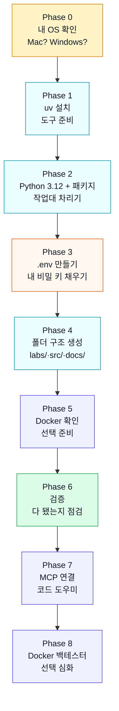

## 내 작업 환경을 어떻게 받는가

> [!info] 학습 목표
>
> - 실습에 쓰는 폴더 구조(`labs/`·`src/`·`docs/`·`.env`)가 각각 무슨 역할인지 그림으로 그릴 수 있다
> - `.env` 파일이 무엇이고, 왜 절대 공유하면 안 되는 비밀 파일인지 설명할 수 있다
> - `uv`가 "가상환경 + 패키지"를 한 번에 관리해주는 도구임을 이해한다
> - 환경을 받는 Phase 0–8 흐름을 단계별로 따라가고, 마지막 검증 한 줄의 의미를 안다

---

## 🎁 코드를 받는 게 아니라, 작업실을 통째로 받는다

[[FD-14-100__background-and-motivation|§100]]에서 이번 주에 무엇을 할지 봤다 — 내 전략을 진짜 증권사 시스템에 연결한다. 그런데 그 일을 하려면 먼저 ==작업할 환경==이 필요하다.

여기서 "환경"은 코드 파일 몇 개가 아니다. 비유하자면 ==잘 정돈된 작업실을 통째로 받는 것==이다.

- 연장이 어디 있는지 정해진 **선반**(폴더 구조)
- 나만 가진 **열쇠 꾸러미**(비밀 키 파일)
- 필요한 **부품들이 미리 갖춰진 작업대**(패키지가 설치된 가상환경)

이걸 손으로 하나하나 만들면 초보자는 시작도 하기 전에 지친다.
- 그래서 이 과정을 자동으로 차려주는 절차가 있다.
- 이것을 **스캐폴딩(scaffolding)** 이라 부른다.
- 건물을 지을 때 임시로 세우는 비계(飛階)처럼, ==본 작업을 시작하기 좋게 발판을 깔아주는 것==이다.

이번 노트는 그 작업실 안을 한 바퀴 둘러본다.
- 코드를 외우는 게 아니라, ==어디에 무엇이 있는지 지도를 머릿속에 그리는 것==이 목표다.

---

#### 🗂️ 작업실 둘러보기 — 폴더 구조

환경을 받으면 아래 같은 폴더들이 생긴다. 각 칸이 무슨 역할인지만 알면 된다.

```text
내-작업-폴더/
├── labs/          ← 실습 코드 (직접 채워가며 연습)
├── src/           ← 공용 도구 (이미 만들어진 부품들)
├── docs/          ← API 사용법 요약 (막히면 찾아볼 설명서)
├── .env           ← 나만의 비밀 키 (절대 공유 금지)
└── verify_setup.py ← 환경이 잘 차려졌는지 확인하는 점검표
```

| 칸       | 역할                 | 비유          |
| ------- | ------------------ | ----------- |
| `labs/` | 내가 채워가며 연습하는 실습 파일 | 직접 쓰는 연습장   |
| `src/`  | 이미 만들어진 공용 도구 모음   | 작업실에 비치된 공구 |
| `docs/` | KIS API 사용법 요약     | 벽에 붙은 설명서   |
| `.env`  | 나만 가진 비밀 키         | 내 열쇠 꾸러미    |

핵심은 ==역할이 칸별로 나뉘어 있다==는 점이다.
- 연습은 `labs/`에서 하고, 이미 만들어진 도구는 `src/`에서 가져다 쓰고, 막히면 `docs/`를 본다.
- 비밀 키만 따로 `.env`에 둔다 — 이게 왜 따로인지가 다음 이야기다.

---

#### 🔐 .env — 왜 따로, 왜 비밀인가

`.env` 파일은 이름 그대로 **환경(environment) 설정**을 담는다.
- 여기에는 ==증권사가 나에게만 발급한 비밀 키==가 들어간다.
- 마치 은행 계좌 비밀번호 같은 것이다.

`.env` 안에는 대략 이런 줄들이 들어간다(실제 키 값은 사람마다 다르다).

```dotenv
# 실행 모드: 강의 시연은 반드시 mock
KIS_MODE=mock
# 모의투자 인증 키 (KIS에서 발급받은 나만의 값)
KIS_MOCK_APP_KEY=...
KIS_MOCK_APP_SECRET=...
KIS_MOCK_ACCOUNT_NUMBER=...
```

이 키가 있어야 증권사 서버가 "아, 이 사람이 보낸 요청이구나"라고 알아본다. 그래서 ==이 파일이 새어 나가면 남이 내 계좌로 요청을 보낼 수 있다==. 그게 비밀인 이유다.

- **GitHub에 절대 올리지 않는다** — 그래서 `.gitignore`라는 목록에 `.env`를 넣어 자동으로 제외한다
- **카톡·메일로 보내지 않는다** — 키 값은 화면에 띄우는 것조차 조심한다
- **`.env.sample`은 공유해도 된다** — 키 값은 비우고 "이런 항목이 필요하다"는 틀만 담은 견본 파일이기 때문이다

> [!warning] ⚠️ .env는 사진 한 장도 위험
> - `.env`의 키 값은 채팅·캡처·화면 공유 어디에도 노출하지 않는다
> - 실수로 공유했다면 KIS Developers에서 키를 **재발급**받아 옛 키를 무효화한다
> - 이 강의는 mock(모의) 키만 쓰므로 진짜 돈 위험은 없지만, 비밀을 다루는 습관 자체를 여기서 들인다

> [!info] 🔄 .env vs .env.sample
> - `.env.sample` = 빈 견본 (모두에게 공유, GitHub에 올림)
> - `.env` = 내 실제 키를 채운 것 (나만 가짐, GitHub에서 제외)
> - 환경을 받으면 견본을 복사해서(`cp .env.sample .env`) 내 키를 채워 넣는다

---

#### 📦 uv — 작업대를 차려주는 도구

Week 1–13에서 이미 써온 도구다.
- 작업을 하려면 `requests`, `pandas` 같은 ==파이썬 부품(패키지)==이 필요하다.
- 그런데 이 부품들을 컴퓨터 전체에 막 깔면 문제가 생긴다.
- 다른 프로젝트와 버전이 충돌하고, 무엇을 깔았는지 추적이 안 된다.

그래서 ==이 프로젝트만의 격리된 작업대==를 따로 만든다.
- 이것을 **가상환경(virtual environment)** 이라 한다.
- `uv`는 이 가상환경을 만들고, 필요한 부품을 그 안에 깔아주는 도구다.

[uv 공식 문서](https://docs.astral.sh/uv)

> [!tip]- uv 이야기
> - `uv`는 Astral이라는 팀이 만든 파이썬 패키지·환경 관리 도구다

| `uv`가 하는 일 | 한 줄 설명                               |
| ---------- | ------------------------------------ |
| 가상환경 만들기   | 이 프로젝트만의 격리된 작업대 생성                  |
| 패키지 설치     | `pandas`·`requests` 같은 부품을 작업대 안에 설치 |
| 실행         | `uv run ...` 으로 그 작업대 위에서 코드 실행      |

기억할 핵심은 하나다.
- 앞으로 코드를 실행할 때 ==그냥 `python`이 아니라 `uv run`을 앞에 붙인다==.
- 그래야 이 프로젝트 전용 작업대 위에서 도는 것이 보장된다.

> [!warning] ⚠️ pip로 직접 깔지 않는다
> - `pip install ...`을 컴퓨터 전체에 바로 쓰면 다른 프로젝트와 부품이 엉킨다
> - 이 강의는 항상 `uv`를 통해서만 부품을 관리한다 — 작업대가 깨끗하게 유지된다

---

#### 🪜 Phase 0–8 — 환경을 받는 한 바퀴

이제 이 작업실이 ==어떤 순서로 차려지는지== 전체 흐름을 본다.
- 이 과정을 단계별로 묶은 것이 Phase 0–8이다.
- 직접 외울 필요는 없다 — 환경을 받을 때 이 순서대로 자동으로 진행된다는 큰 그림만 잡으면 된다.



*위에서 아래로 한 번 흐르면 작업실이 완성된다. 앞 단계가 끝나야 다음 단계가 의미를 갖는 순서다 — 도구(uv)가 있어야 작업대를 차리고, 작업대가 있어야 비밀 키를 꽂는다.*

각 Phase가 무슨 일을 하는지 한 줄씩 본다.

| Phase | 하는 일         | 한 줄 의미                             |
| :---: | ------------ | ---------------------------------- |
|   0   | OS 감지        | 내가 Mac인지 Windows인지 확인 (이후 명령이 달라짐) |
|   1   | `uv` 설치      | 환경을 차릴 도구부터 준비                     |
|   2   | Python + 패키지 | 작업대 생성 + 부품 설치                     |
|   3   | `.env` 생성    | 견본 복사 후 내 KIS 비밀 키 입력              |
|   4   | 폴더 구조        | `labs/`·`src/`·`docs/` 등 선반 만들기    |
|   5   | Docker 확인      | 백테스트 도구가 있는지만 확인 (선택 준비)           |
|   6   | 환경 검증        | "전부 잘 차려졌나?" 최종 점검                 |
|   7   | MCP 연결        | 코드가 막힐 때 쓰는 KIS 코드 도우미 연결          |
|   8   | Docker 백테스터  | 선택 심화: 백테스트 엔진 실행                  |

> [!tip]- Phase 7–8은 뒤에서 자세히 다룬다
> - Phase 7 MCP는 코드가 막혔을 때 도와주는 AI 도우미다 — [[FD-14-400__code-assistant-mcp|§400 MCP]]에서 다룬다
> - Phase 8 Docker 백테스터는 선택 심화다 — [[FD-14-500__docker-install|§500 Docker]]에서 다룬다
> - 지금은 "검증까지 끝나면 노트북을 시작한다" 정도만 알면 충분하다

---

#### ✅ 마지막 한 줄 — 검증

모든 Phase가 끝나면 ==작업실이 제대로 차려졌는지 확인==하는 단계가 있다.
- 점검표를 자동으로 훑어주는 명령 한 줄이다.

```bash
uv run verify_setup.py
```

이 한 줄이 아래 항목들을 차례로 점검하고 ✅/❌로 알려준다.

- Python 버전이 3.12 이상인가
- `.env` 파일이 있고, mock 키가 채워졌는가
- `labs/` 폴더와 실습 파일이 제자리에 있는가
- `requests`·`pandas` 같은 부품이 설치됐는가

전부 ✅면 작업실이 완성된 것이다. 하나라도 ❌면 그 항목만 고치고 다시 실행하면 된다. ==이 한 줄이 통과하는 순간이 이번 주 실습의 출발선==이다.

> [!tip] 🤖 ❌가 떠도 당황하지 않는다
> - `verify_setup.py`에서 ❌가 떠도 당황하지 않는다 — 어디가 빠졌는지 알려주는 ==점검표==일 뿐이다
> - ==에러 메시지를 그대로 복사해 AI 도우미에게 물어보면== 무엇을 고치면 되는지 바로 알려준다

> [!info] 🔑 핵심은 "키와 라벨"이 아니라 "흐름"
> - 이 노트에서 명령어를 통째로 외울 필요는 없다
> - `labs/`·`src/`·`docs/`·`.env`가 각각 무슨 역할인지, `uv`가 왜 필요한지, Phase가 어떤 순서로 흐르는지 — 이 **지도**만 머릿속에 있으면 된다
> - 실제 손으로 따라 하는 단계는 동반 실습 노트북에서 한 칸씩 진행한다

---

## 🔖 핵심 요약

> [!summary] 🏆 이 노트를 마쳤다면?
>
> - [ ] `labs/`·`src/`·`docs/`·`.env` 네 칸이 각각 무슨 역할인지 한 문장씩 말할 수 있다
> - [ ] `.env`가 왜 비밀이며 GitHub에 올리지 않는지, `.env.sample`과 어떻게 다른지 설명할 수 있다
> - [ ] `uv`가 "가상환경 + 패키지"를 합친 도구이며 `uv run`을 앞에 붙이는 이유를 안다
> - [ ] Phase 0–8이 "도구 → 작업대 → 비밀 키 → 폴더 → 검증" 순서로 흐른다는 큰 그림을 그릴 수 있다
> - [ ] `uv run verify_setup.py`가 통과하면 실습을 시작할 준비가 끝났다는 의미임을 안다
> - [ ] 다음 단계로 [[FD-14-300__account-and-trading|§300 거래 실습]]에서 첫 모의 주문을 향해 나아간다
