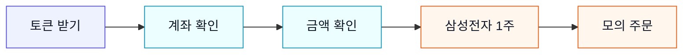

## 계좌를 확인하고, 첫 모의 주문을 넣는다

> [!info] 학습 목표
>
> - `get_token()`으로 KIS 요청에 필요한 토큰을 받을 수 있다
> - 모의 계좌의 보유 종목과 금액을 확인할 수 있다
> - 삼성전자 1주 모의 주문을 교수 안내 후 실행할 수 있다
> - 낯선 KIS 필드명은 외우지 않고, helper 함수와 MCP로 처리한다

---

## 🎯 오늘의 성공 경험

오늘 목표는 복잡한 자동매매가 아니다. ==내 코드가 KIS 모의계좌를 읽고, 아주 작은 주문을 한 번 보내는 것==이다.



*이 그림에서 학생이 직접 기억할 이름은 `token`, `balance`, `summary`, `response` 네 개다.*

*계좌상품코드 같은 KIS 내부 이름은 오늘 외우지 않는다 — helper 함수 안에 숨겨 두고, 궁금할 때 MCP로 확인한다.*

---

#### 🔑 1단계 — 토큰 받기

- KIS 서버는 먼저 “누가 요청했는가”를 확인한다.
- 그 확인표가 `token`이다.
- 학생이 쓰는 코드는 한 줄이다.

```python
token = get_token()
print(token[:8])
# 예상 출력: eyJ0eXAi
```

토큰 원문 요청(`POST /oauth2/tokenP`)은 `src/kis_client.py`가 처리한다. 학생은 토큰을 매번 새로 발급하지 않고, `get_token()`으로 받아서 재사용한다.

---

#### 💼 2단계 — 계좌 확인

- 토큰이 있으면 계좌를 읽을 수 있다.
- 먼저 “보유 종목이 몇 개인지”만 본다.
- 읽기 전용 조회라 주문은 나가지 않는다.

```python
balance = fetch_balance(token)
print(len(balance))
# 예상 출력: 0
```

`fetch_balance()` 안쪽에는 KIS가 요구하는 계좌번호와 상품코드가 들어간다. 그 세부 이름은 학생이 직접 치지 않는다.

---

#### 💰 3단계 — 금액 확인

- 주문 전에 현금과 총 평가금액을 본다.
- 오늘은 숫자 세 개만 확인하면 충분하다.
- “내가 주문할 수 있는 계좌인가”를 확인하는 단계다.

```python
summary = fetch_account_summary(token)
print(summary)
# 예상 출력: {'cash': '1,000,000원', 'stock_value': '0원', 'total_value': '1,000,000원'}
```

금액 응답의 원래 필드명은 복잡하다. 그래서 `fetch_account_summary()`가 초보자용 이름으로 바꿔서 돌려준다.

---

#### 🛒 4단계 — 가장 작은 주문

- 첫 주문은 크게 하지 않는다.
- 삼성전자 1주처럼 눈으로 확인 가능한 작은 주문만 쓴다.
- 강의 기본은 항상 모의투자(mock)다.

```python
ticker = "005930"
qty = 1
# 예상 출력: 없음
```

종목코드와 수량을 정했으면 주문 준비는 끝난다. 시장가·계좌상품코드 같은 세부값은 `place_order()`가 처리한다.

---

#### ✅ 5단계 — 모의 주문해보기

- 교수 안내 후 아래 한 줄을 실행한다.
- `KIS_MODE=mock`일 때만 모의 서버로 간다.
- 성공하면 KIS 응답 메시지가 돌아온다.

```python
response = place_order(token, ticker, qty)
print(response.get("msg1", response))
# 예상 출력: 모의투자 주문 응답 메시지
```

여기서 중요한 성공 경험은 “내 코드가 계좌를 읽고 주문 요청까지 보냈다”는 감각이다. 주문 필드명을 외우는 것이 아니다.

---

#### 🤖 막히면 MCP에게 묻는다

- 낯선 주문 필드명이 보이면 외우려 하지 않는다.
- AI 채팅에 “kis-code-assistant MCP로 이 필드 뜻을 찾아줘”라고 묻는다.
- MCP는 공식 코드와 문서를 읽어 답할 뿐, 주문을 넣지는 않는다.

```text
kis-code-assistant MCP로 국내주식 시장가 매수 주문 예시를 찾아줘.
주문 구분, 주문 수량, 주문 가격이 각각 무엇인지 짧게 말해줘.
```

MCP는 초보자가 KIS 약어에 막히지 않게 해 주는 안전망이다. 답을 받은 뒤에는 노트북의 짧은 코드로 다시 돌아오면 된다.

---

## 🔖 핵심 요약

> [!summary] 오늘 끝나면 충분한 것
>
> - [ ] `token = get_token()`으로 토큰을 받았다
> - [ ] `fetch_balance(token)`으로 계좌를 읽었다
> - [ ] `fetch_account_summary(token)`으로 금액을 확인했다
> - [ ] `place_order(token, "005930", 1)` 흐름을 이해했다
> - [ ] KIS 약어는 외우는 게 아니라 helper와 MCP로 처리한다는 점을 안다
