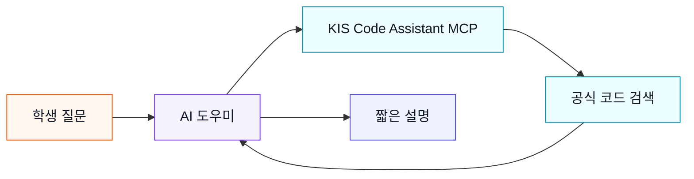

## 막힐 때 KIS 코드 도우미에게 묻는다

> [!info] 학습 목표
>
> - MCP가 AI 도우미를 KIS 공식 코드·문서에 연결하는 통로임을 안다
> - 학생이 직접 할 일은 `MCP 연결해줘` 한마디임을 안다
> - KIS Code Assistant MCP는 키도 주문도 없는 read-only 도구임을 안다
> - 낯선 필드명은 외우지 않고 MCP에게 물어보면 된다는 감각을 갖는다

---

## 🧭 MCP가 필요한 순간

KIS API에는 낯선 이름이 많다. 주문 구분, 거래 ID, 계좌상품코드 같은 내부 이름을 처음부터 외우라고 하면 초보자는 바로 막힌다.

그래서 이번 강의에서는 외우게 하지 않는다. ==막히면 AI 도우미가 KIS 공식 코드에서 근거를 찾아오게 한다.==



*MCP는 주문 버튼이 아니라 검색 통로다. 공식 코드를 읽어서 학생 질문에 답하게 해 준다.*

---

#### 1단계 — 설치는 한마디로 맡긴다

- 학생이 긴 설치 명령을 외울 필요는 없다.
- AI 코딩 도구에 아래처럼 말한다.
- 연결이 끝나면 도구 목록에 `kis-code-assistant`가 보인다.

```text
MCP 연결해줘
```

설치가 막히면 손으로 설정 파일을 고치지 않는다. 같은 채팅창에 오류 메시지를 붙여 넣고 다시 물어본다.

---

#### 2단계 — 이렇게 묻는다

- 질문은 평소 말하듯이 한다.
- “MCP를 사용했는지”와 “근거가 어디인지”를 같이 요구한다.
- 답이 길면 “세 줄로 줄여줘”라고 다시 말한다.

```text
kis-code-assistant MCP로 국내주식 시장가 매수 주문 예시를 찾아줘.
주문 구분, 주문 수량, 주문 가격이 무엇인지 초보자용으로 설명해줘.
```

```text
kis-code-assistant MCP로 잔고 조회 API 예시를 찾아줘.
계좌상품코드가 무엇인지 한 문장으로만 설명해줘.
```

---

#### 3단계 — 안전한 이유

- 이 MCP는 KIS APP Key가 필요 없다.
- 계좌번호도 받지 않는다.
- 매수·매도 주문을 실행하는 기능도 없다.

| 항목 | KIS Code Assistant MCP |
|------|------------------------|
| 역할 | 공식 코드·문서 검색 |
| 키 입력 | 필요 없음 |
| 주문 실행 | 불가 |
| 학생이 얻는 것 | 낯선 KIS 이름의 근거 있는 설명 |

자연어로 실제 주문을 넣는 Trading MCP는 이 강의에서 다루지 않는다. 아직 기본 경로가 아니고, 교수 안내 없이 연결하지 않는다.

---

## 🔖 핵심 요약

> [!summary] 오늘 끝나면 충분한 것
>
> - [ ] `MCP 연결해줘`라고 말하면 설치·연결을 맡길 수 있다
> - [ ] KIS Code Assistant MCP는 검색 도구라 주문을 넣지 않는다
> - [ ] 낯선 KIS 약어는 외우지 않고 MCP에게 뜻과 근거를 물어본다
> - [ ] 답이 길면 세 줄로 줄여 달라고 다시 요청한다
