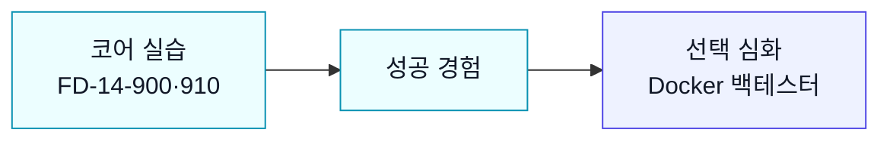

## 선택 심화: Docker 백테스터 준비

> [!info] 학습 목표
>
> - Docker가 백테스터 실행 환경을 띄우는 선택 도구임을 안다
> - 계좌 확인·모의 주문·노트북 백테스트는 Docker 없이도 끝난다는 점을 안다
> - 교수 안내가 있을 때만 Docker 백테스터를 실행한다

---

## 🐳 Docker는 코어 성공 이후의 선택 단계

전반부 계좌 실습과 후반부 노트북 백테스트는 Docker 없이도 끝난다. Docker는 `open-trading-api/backtester` 웹 UI를 띄워 더 큰 백테스터를 써 보고 싶을 때 필요하다.



*Docker가 안 돼도 Week14의 핵심 성공은 이미 가능하다. Docker는 더 큰 백테스트 환경을 여는 선택 문이다.*

---

#### 설치 확인만 한다

- Docker Desktop을 설치한다.
- 앱을 실행해 둔다.
- 터미널에서 두 줄만 확인한다.

```bash
docker --version
docker ps
```

`docker ps`가 에러 없이 헤더를 보여주면 충분하다. 컨테이너가 없어도 정상이다.

---

#### 백테스터 실행은 교수 안내 후

- `open-trading-api`가 준비된 상태에서 실행한다.
- 첫 실행은 시간이 오래 걸릴 수 있다.
- Windows는 WSL 쪽에서 실행한다.

```bash
cd <open-trading-api>/backtester
./start.sh
```

이 단계가 막히면 노트북 실습으로 돌아간다. 오늘의 필수 흐름은 `strategy → orders → bt`다.

---

## 🔖 핵심 요약

> [!summary] 오늘 끝나면 충분한 것
>
> - [ ] Docker는 선택 심화이며 코어 실습의 필수 조건이 아님을 안다
> - [ ] `docker --version`, `docker ps`로 설치만 확인할 수 있다
> - [ ] 백테스터 실행은 교수 안내 후 진행한다
